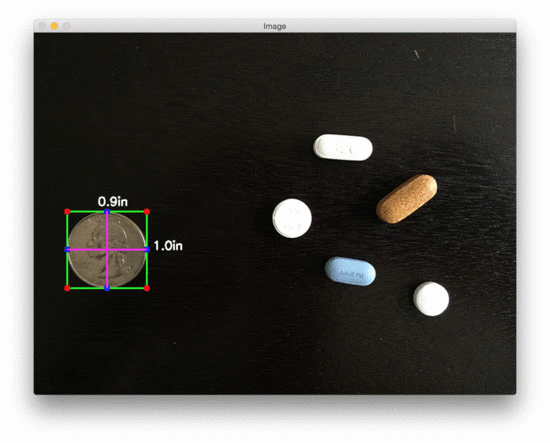
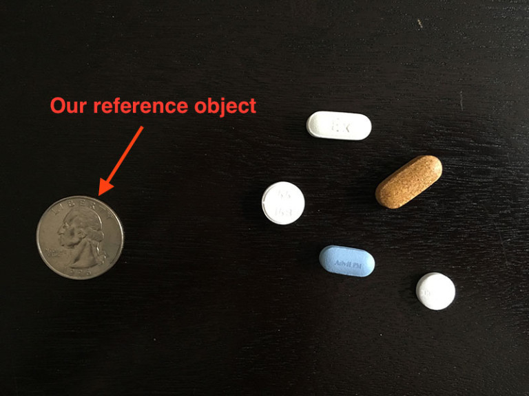

用OpenCV测量物体的尺寸



在图片中测量物体的大小与计算相机与物体的距离相似——都是需要定义个比率来度量每个给定指标的像素数（pixels per metric ratio）。

**什么是pixels per metric ratio **

为了确定图片中一个物体的大小，首先，我们需要使用参考物体进行“校准”（利用内置或外在的校准，避免混乱）。我们的参考物体需要有两个重要的性质：

性质1：我们应该知道物体的尺寸（就是宽或高）包括测量的单位（如mm、英寸等等）

性质2：我们应该能够很容易地在图片中找到参照物体，无论是基于物体的位置（例如，参考物体总是放在图片的左上角）还是通过外观（例如，独特的颜色或形状，不同与图片中的其他物体）。无论是哪种情况，我们的参照物都应该以某种方式具有唯一的可识别性。

在本例中，我们将使用美国硬币作为我们的参考对象，在所有的示例中，确保它始终是图片中的最左侧的对象。



通过确保硬币是最左边的物体，我们可以从左到右对物体轮廓进行排序，获取硬币（始终是排序列表中的第一个轮廓），并使用它定义每个单位的像素数，我们将其定义为：

*pixels_per_metric = object_width / know_width*

已知硬币的宽度为0.955英寸。现在假设，物体的宽为150像素（基于其关联的边界框）。

pixels_per_metric可得：

pixels_per_metric=150px/0.955in = 157px/in

因此，在图片中应用每英寸所占的像素点为157个。使用这个比率，我们可以计算图片中物体的大小。

**利用计算机视觉测量物体的大小**

现在我们理解了pixels_per_metric比率的含义，我们可以应用python运行代码来测量图片中的物体大小。

打开一个文件，命名为 object_size.py，并插入以下代码：

```python
# 导入必要的包
from scipy.spatial import distance as dist
from imutils import perspective
from imutils import contours
import numpy as np
import argparse
import imutils
import cv2

def midpoint(ptA, ptB):
    return ((ptA[0]+ptB[0])*0.5, (ptA[1]+ptB[1])*0.5)

# 构造解析参数
ap = argparse.ArugmentParser()
ap.add_argument("-i", "--image", required=True, 
               help="path to the input image")
ap.add_argument("-w", "--width", required=True,
               help="width of the left-most object in the image(in inches)")
args = vars(ap.parse_args())
```

Line2-8导入我们需要的python库。在本例中，我们将大量使用imutils包，因此如果你还没有安装，请确保在运行之前安装它：

```python
pip3 install imutils
```

除此之外，如果你安装了imutils，请确保你安装了最新版本的，本例中imutils的版本为“0.5.2”

```python
pip3 install --upgrade imutils
```

Line10-11定义个midpoint的辅助函数，从它的名字可知，该函数是用于计算两组（x，y）坐标的中点。

在Line14-19构造解析参数。我们需要两个参数，--image，我们需要测量的物体图片的路径，--width，参考物体的宽（单位in），假定它是我们图片中的最左边的对象。

现在，我们导入图片并处理：

```python
# 导入图片转换为灰度图，并进行轻微的模糊
image = cv2.imread(args["image"])
gray = cv2.cvtColor(image, cv2.COLOR_BGR2GRAY)
gray = cv2.GaussianBlur(gray, (7, 7), 0)

# 执行边缘检测
# 然后在物体之间的边缘执行膨胀+腐蚀操作使其缝隙闭合
edged = cv2.Canny(gray, 50, 100)
edged = cv2.dilate(edged, None, iterations=1)
edged = cv2.erode(edged, None, iterations=1)

# 在边缘图中查找轮廓
cnts = cv2.findContours(edged.copy(), cv2.RETR_EXTERNAL,
                       cv2.CHAIN_APPROX_SIMPLE)
cnts = imutils.grab_contours(cnts)

# 从左往右对轮廓进行排序
# 初始化'pixels per metric' 校准变量
(cnts, _) = contours.sort_contours(cnts)
pixelsPerMetric = None
```

Line2-4 从磁盘中导入图片，转换为灰度图，然后用高斯滤波进行平滑。然后，我们执行边缘检测和膨胀+腐蚀操作以闭合边缘图片中所有边缘之间的间隙。

Line13-15在我们的边缘图片中找相应物体的轮廓。

Line19将这些轮廓从左往右排序。在Line初始化'pixels per metric' 的值

下一步就是去检测每个轮廓:

```python
# 分布遍历这些轮廓
for c in cnts:
    # 如果轮廓不够大，直接忽略
    if cv2.contourArea(c)<100:
        continue
    
    # 计算轮廓的选择框
    orig = image.copy()
    box = cv2.minAreaRect(c)
    box = cv2.cv.BoxPoints(box) if imutils.is_cv2() else cv2.boxPoints(box)
    box = np.array(box, dtype="int")
    
    # 对轮廓点进行排序，顺序为左上，右上，右下和左下
    # 然后绘制旋转边界框的轮廓
    box = perspective.order_points(box)
    cv2.drawContours(orig, [box.astype("int")], -1, (0,255,0), 2)
    
    # 遍历原始点并绘制出来
    for (x, y) in box:
        cv2.circle(orig, (int(x), int(y)), 5, (0,0,255), -1)
```

Line2，我们开始遍历每个单独的轮廓。如果轮廓不够大，则会丢弃该区域，认为该区域是边缘检测过程中留下的噪声（Line4和Line5）。

如果轮廓区域足够大，在第9-11行计算图中的选择边界框，特别注意OpenCV2使用的是cv2.cv.BoxPoints函数，OpenCV3使用的是cv2.boxPoints函数。  

然后，我们按照左上、右上、右下和左下的顺序排列旋转的边界框坐标。

最后，第16-20行用绿色的线画出物体的轮廓，然后用红色的小圆圈绘制出边界框矩形的顶点。

现在我们已经对边界框进行了排序，我们可以计算一系列的中点：

```python
    # 打开有序的边界框，然后计算左上和右上坐标之间的中点，
    # 再计算左下和右下坐标之间的中点
	(tl, tr, br, bl) = box
	(tltrX, tltrY) = midpoint(tl, tr)
	(blbrX, blbrY) = midpoint(bl, br)

	# 计算左上点和右上点之间的中点
	# 然后是右上角和右下角之间的中点
	(tlblX, tlblY) = midpoint(tl, bl)
	(trbrX, trbrY) = midpoint(tr, br)

	# 在图中画出中点
	cv2.circle(orig, (int(tltrX), int(tltrY)), 5, (255, 0, 0), -1)
	cv2.circle(orig, (int(blbrX), int(blbrY)), 5, (255, 0, 0), -1)
	cv2.circle(orig, (int(tlblX), int(tlblY)), 5, (255, 0, 0), -1)
	cv2.circle(orig, (int(trbrX), int(trbrY)), 5, (255, 0, 0), -1)

	# 在中点之间绘制线
	cv2.line(orig, (int(tltrX), int(tltrY)), (int(blbrX), int(blbrY)),
		(255, 0, 255), 2)
	cv2.line(orig, (int(tlblX), int(tlblY)), (int(trbrX), int(trbrY)),
		(255, 0, 255), 2)
```

第3-5行取出有序的边界框，然后计算左上和右上点之间的中点，再计算左下和右下点之间的中点。

我们还将分别计算左上+左下和右上+右下之间的中点。

第13-16行在图中画出蓝色的中点，然后用紫色线连接中点。

接下来，我们通过分析参考物体来初始化pixelsPerMetric值

```python
	# 计算中点间的欧式距离
	dA = dist.euclidean((tltrX, tltrY), (blbrX, blbrY))
	dB = dist.euclidean((tlblX, tlblY), (trbrX, trbrY))
 
	# 如果pixels per metric还未初始化，
    # 则将其计算为像素与提供的度量的比率（本例中为英寸）
	if pixelsPerMetric is None:
		pixelsPerMetric = dB / args["width"]
```

第2-3行计算集合中的中点的欧式距离。dA保存的是高度距离，dB保存的是宽度距离。

然后，我在第7行进行检测pixelsPerMetric是否被初始化了，如果未被初始化，我们通过用dB出于--width提供的值，得到我们需要每英寸的像素数。

现在pixelsPerMetric的值已经被定义，我们可以测量图片中物体的大小

```python
	# 计算物体的大小
	dimA = dA / pixelsPerMetric
	dimB = dB / pixelsPerMetric
 
	# 在图中画出物体的大小
	cv2.putText(orig, "{:.1f}in".format(dimA),
		(int(tltrX - 15), int(tltrY - 10)), cv2.FONT_HERSHEY_SIMPLEX,
		0.65, (255, 255, 255), 2)
	cv2.putText(orig, "{:.1f}in".format(dimB),
		(int(trbrX + 10), int(trbrY)), cv2.FONT_HERSHEY_SIMPLEX,
		0.65, (255, 255, 255), 2)
 
	# 显示输出图片
	cv2.imshow("Image", orig)
	cv2.waitKey(0)
```

第2-3行通过对应的欧式距离除以pixelsPerMetric计算得到物体的尺寸。

第6-11行在图中画出物体的尺寸，而第14-15行为显示输出结果的图片。

**物体尺寸测量结果**

在命令行中输入：

```
python object_size.py --image images/example_01.png --width 0.955
```

输出结果如下图所示：


如上图所示，我们已经成功的计算出图片中每个物体的尺寸。

然而，并非所有的结果都是完美的。

可能的原因

1、拍摄的角度并非是一个完美的90°俯视。如果不是90°拍摄，物体的尺寸可能会出现扭曲。

2、没有使用相机内在和外在参数来校准。当无法确定这些参数时，照片很容易发生径向和切向的透镜变形。执行额外的校准步骤来找到这些参数可以消除图片中的失真并得到更好的物体大小的近似值。

**总结**

在本文中，我们学习了如何通过使用python和OpenCV来测量图片中的物体的大小。

我们需要确定pixels per metric比率（单位尺寸像素数），即在给定的度量（如英寸、毫米、米等）下，像素的数量。

为了计算这个比率，我们需要一个参考物体，它需要两点重要的性质：

1、参考物体需要有含测量单位（英寸、毫米等等）的尺寸

2、无论从物体的位置还是形状，参考物体都需要容易被找到。

加入上面的性质都能满足，你可以使用参考物体计算pixels per metric比率，并根据这个计算图片中物体的大小。

英文原文：https://www.pyimagesearch.com/2016/03/28/measuring-size-of-objects-in-an-image-with-opencv/

其他参考项目：https://github.com/snsharma1311/object-size